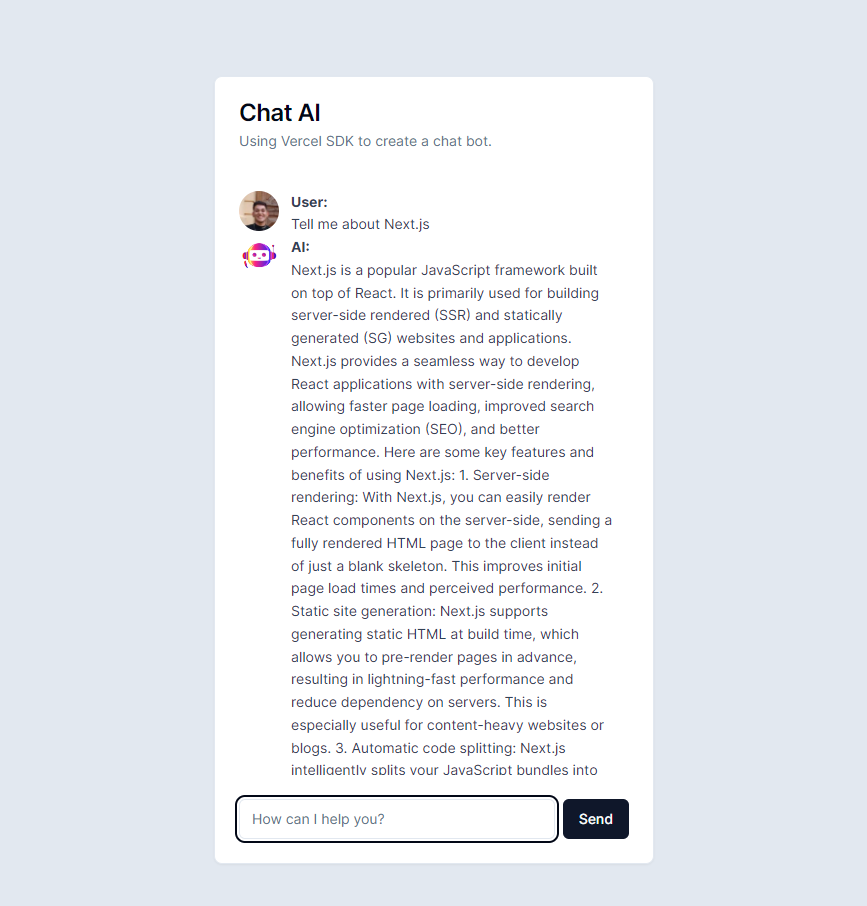

# Chatbot with OpenAI, Vercel SDK, and Shadcn/UI

## Overview

This project is a chatbot integrated with the OpenAI API using the Vercel SDK and the Shadcn/UI library to create an interactive chat interface.



## Installation

Follow the steps below to set up and run the project in your local environment.

1. **Clone the repository:**

   ```bash
   git clone https://github.com/guifelippe/chatbot-ai-rocketseat.git

2. **Install dependencies:**

    ```bash
   cd chatbot-ai-rocketseat
   npm install

3. **OpenAI API Configuration:** You will need an OpenAI API key. Copy the .env.example file to .env and set your API key in the .env file.

4. **Start the development server**:

    ```bash
    npm run serve

5. **Access the application in your browser:** Open your browser and access http://localhost:3000 to see the chatbot in action.

## Credits

This project was developed based on the Rocketseat tutorial. We appreciate Rocketseat for providing an excellent learning resource.
